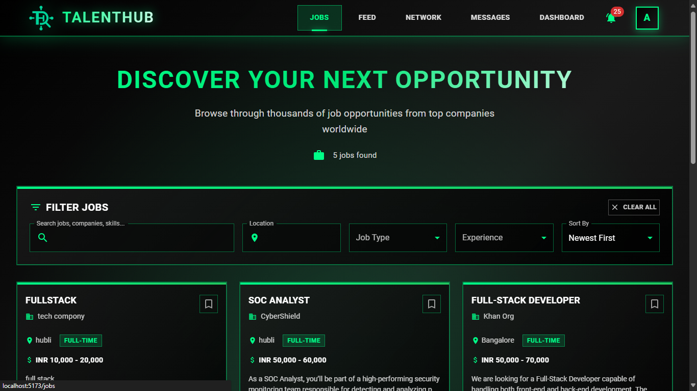

<div align="center">
  
  
  # TalentHub - Modern Job Portal Platform
  
  > A comprehensive full-stack job portal connecting talented candidates with leading employers through an intuitive, feature-rich platform.
</div>


## Key Features

### For Candidates
- **Smart Job Discovery** - Advanced search and filtering system
- **Profile Management** - Complete profile setup with resume upload
- **One-Click Applications** - Streamlined application process
- **Real-time Notifications** - Stay updated on application status
- **Application Dashboard** - Track all applications in one place
- **Social Feed** - Connect and network with professionals

### For Recruiters  
- **Job Management** - Post, edit, and manage job openings
- **Application Review** - Comprehensive candidate evaluation tools
- **Advanced Analytics** - Insights on job performance and applications
- **Candidate Search** - Find the perfect candidates with smart filters
- **Communication Hub** - Direct messaging with applicants
- **Status Management** - Track hiring pipeline efficiently



## Tech Stack

| Frontend | Backend | Database & Tools |
|----------|---------|------------------|
| React.js 18+ | Node.js & Express | MongoDB |
| Material-UI | JWT Authentication | Mongoose ODM |
| Framer Motion | Multer File Upload | Socket.io |
| React Router | Rate Limiting | bcrypt.js |

## Quick Start

### Prerequisites
- **Node.js** v18+ (v22 recommended)
- **MongoDB** (local or Atlas)
- **npm** or **yarn**

### Installation

1. **Clone the repository**
```bash
git clone https://github.com/MubbassirKhan/job-portal.git
cd job-portal
```

2. **Install dependencies**
```bash
# Install all dependencies (client + server)
npm run install-deps
```

3. **Environment Setup**

Create `.env` in the `server` directory:
```env
NODE_ENV=development
PORT=5000
MONGODB_URI=mongodb://localhost:27017/talenthub
JWT_SECRET=your-super-secret-jwt-key-here
JWT_EXPIRE=7d
BCRYPT_ROUNDS=12
CLIENT_URL=http://localhost:5173
```

4. **Start Development Servers**
```bash
# Starts both frontend (Vite) and backend (Express)
npm run dev
```

**Access your application:**
- **Frontend:** http://localhost:5173
- **Backend API:** http://localhost:5000

### Production Build

```bash
npm run build
```

## Project Architecture

```
talenthub/
├── client/                 # React Frontend
│   ├── src/
│   │   ├── components/     # Reusable UI components
│   │   ├── pages/          # Application pages
│   │   ├── context/        # State management
│   │   ├── hooks/          # Custom React hooks
│   │   └── utils/          # API utilities
│   └── package.json
├── server/                 # Node.js Backend
│   ├── controllers/        # Business logic
│   ├── models/             # Database schemas
│   ├── routes/             # API endpoints
│   ├── middleware/         # Custom middleware
│   └── uploads/            # File storage
└── frontend/               # Alternative frontend (if exists)
```


## Security Features

- **JWT Authentication** - Secure token-based auth
- **Password Encryption** - bcrypt hashing
- **Rate Limiting** - API abuse prevention
- **Input Validation** - Data sanitization
- **File Upload Security** - Safe resume handling
- **CORS Protection** - Cross-origin security

## Developer

**Mubbassir Khan**  
Full Stack Developer | Dharwad, Karnataka, India

[](https://linkedin.com/in/mubbassir-khan-jahagirdar-081715271)
[](https://www.instagram.com/mubbassir_khan/)
[](https://wa.me/917619175596)

**Contact:** +91 7619175596  
**Email:** contact@mubbassirkhan.dev

## Contributing

1. **Fork** the repository
2. **Create** your feature branch (`git checkout -b feature/amazing-feature`)
3. **Commit** your changes (`git commit -m 'Add amazing feature'`)
4. **Push** to the branch (`git push origin feature/amazing-feature`)
5. **Open** a Pull Request

## License

This project is licensed under the **MIT License** - see the [LICENSE](LICENSE) file for details.

## Show Your Support

If this project helped you, please consider giving it a star

---

<div align="center">
  <strong>Built with ❤️ by Mubbassir Khan</strong>
</div>